# Woman Safety App 📖

## 🖼 App Screenshots

### 🔹 Row 1

  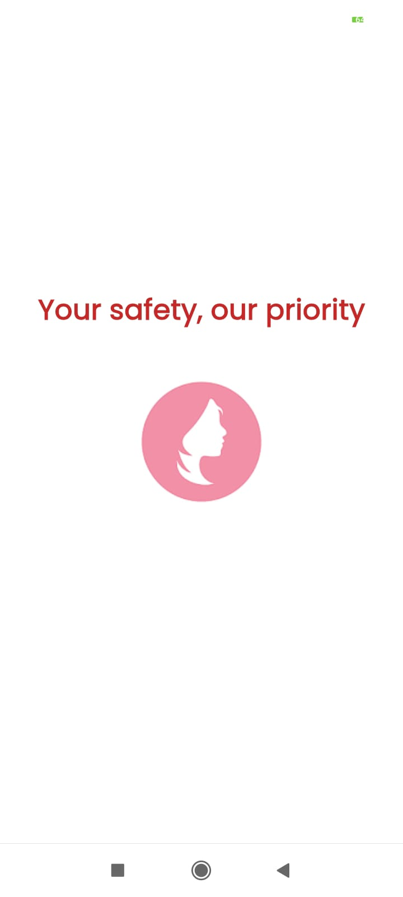
  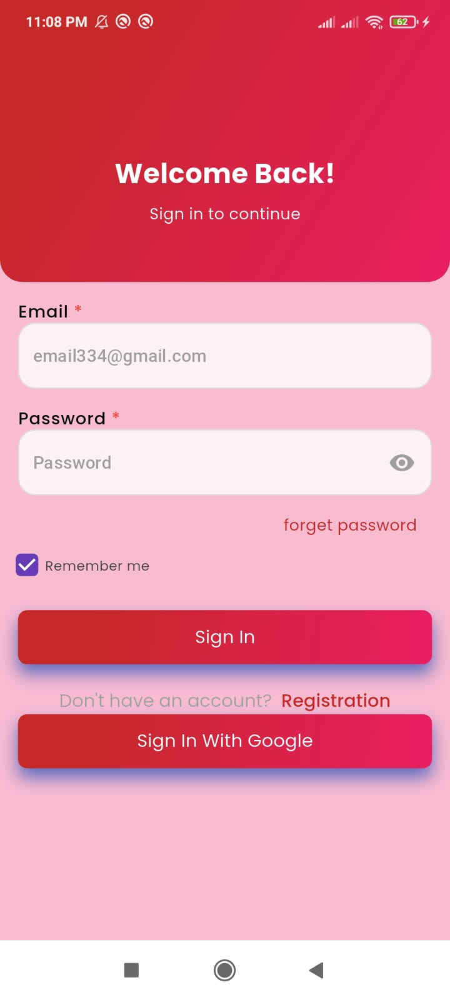
  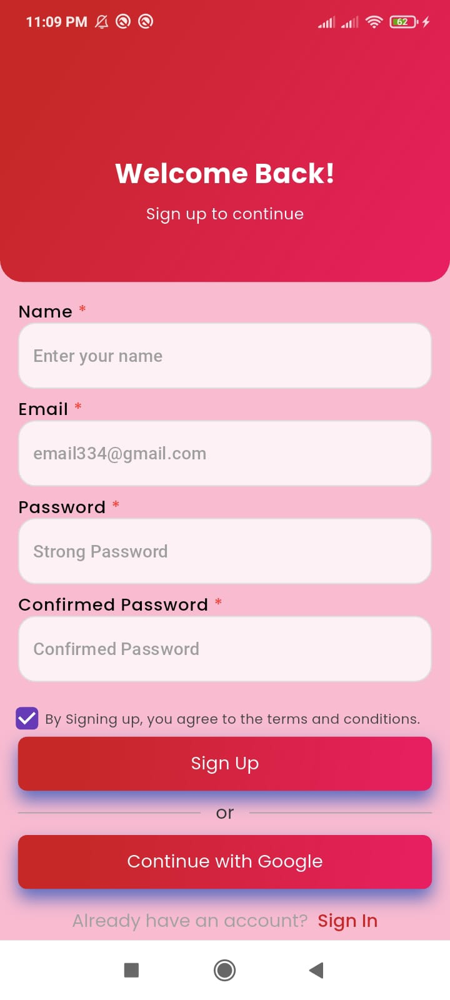
  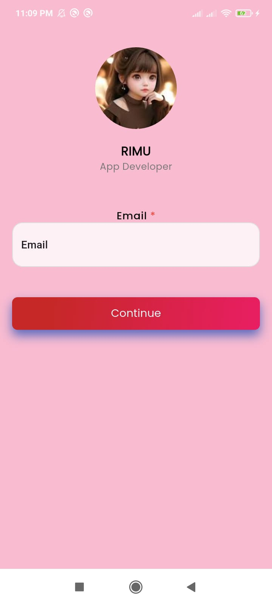

### 🔹 Row 2

  
  
  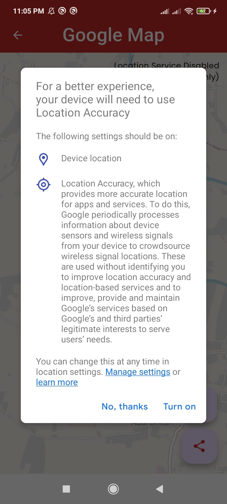
  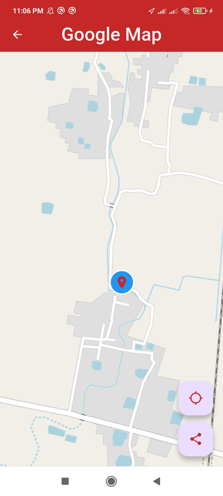

### 🔹 Row 3

  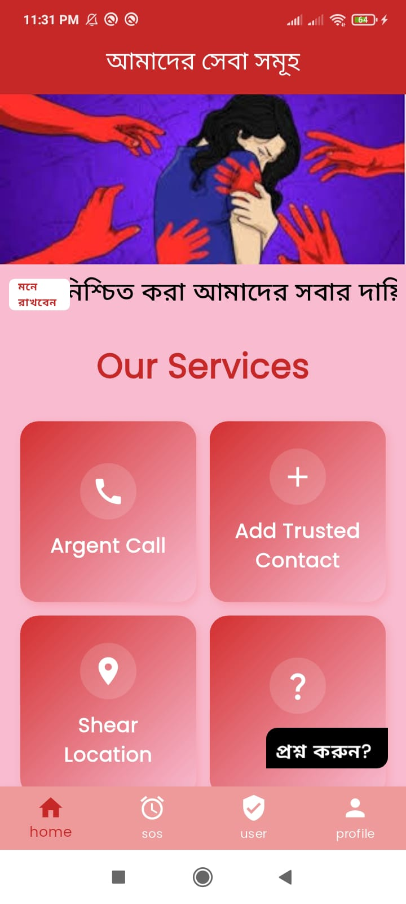
  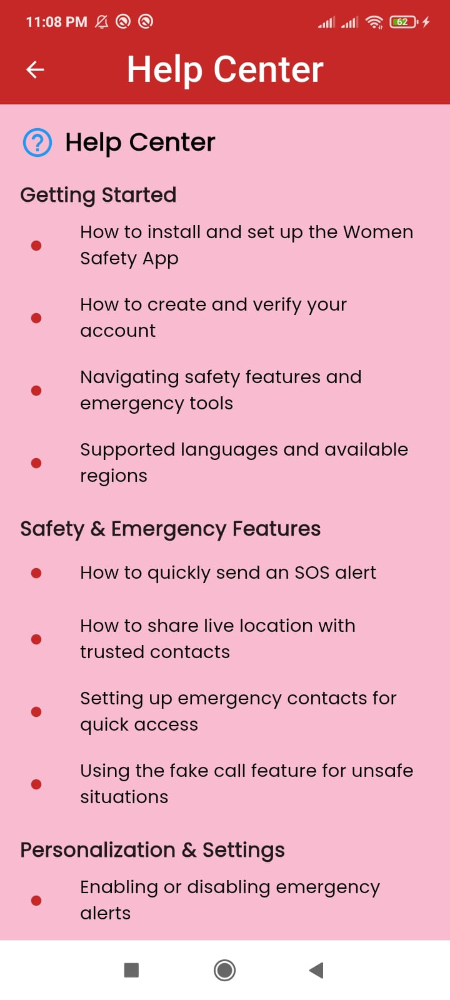
  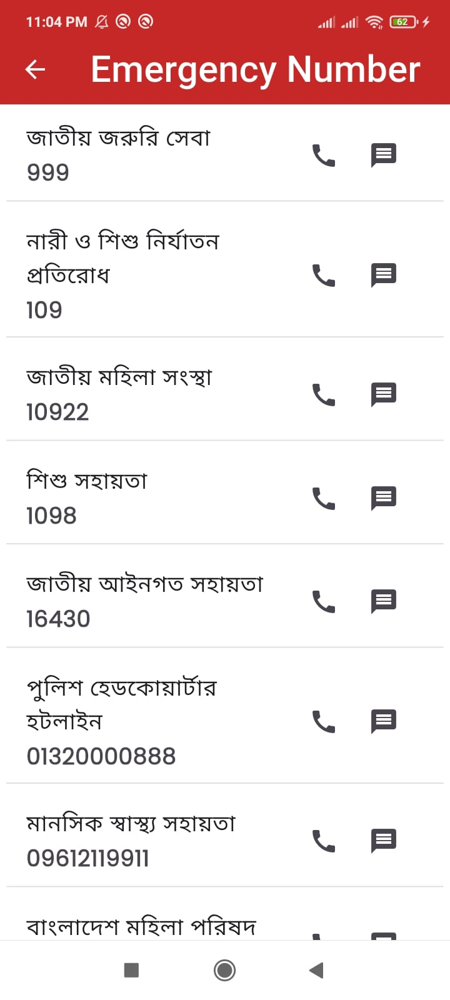
  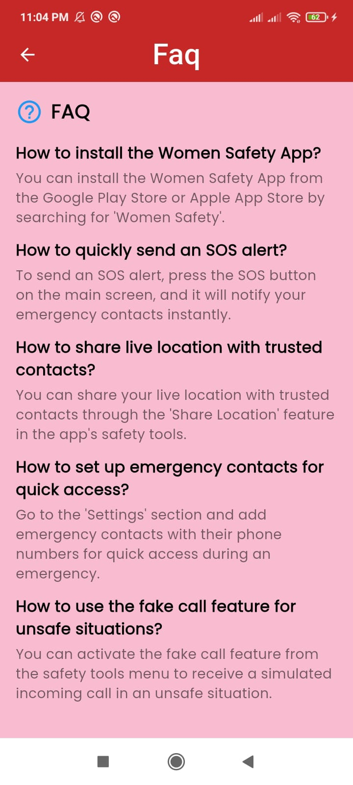

### 🔹 Row 4

  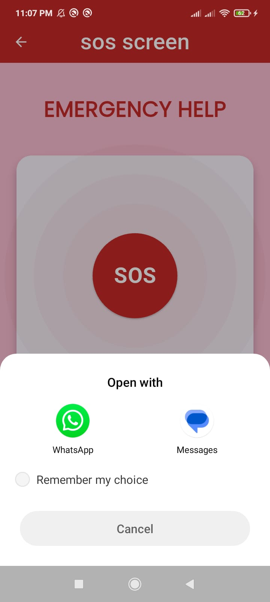
  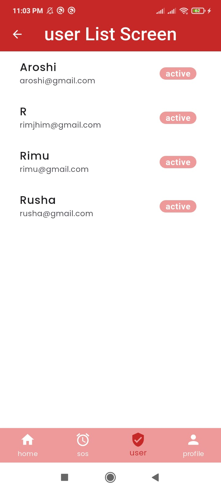
  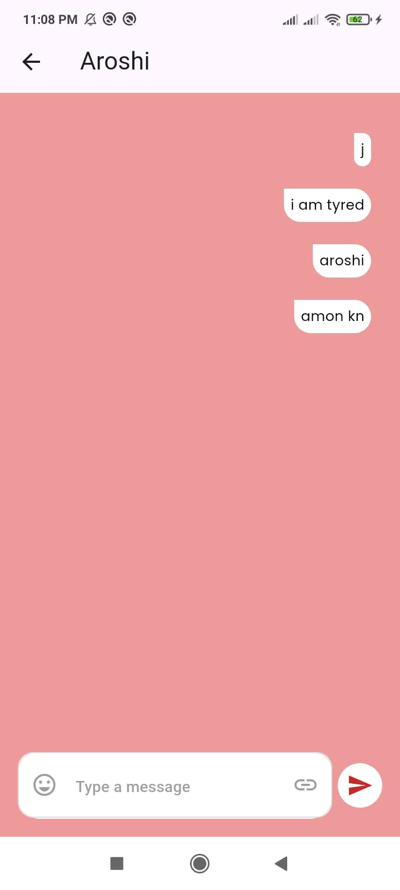
  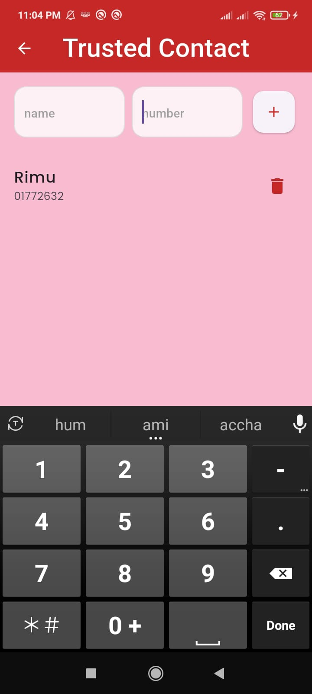

### 🔹 Row 5

 

---

## 🛠️ Technologies Used

This app is built with the following technologies:

- 🔹 **Flutter** (UI development)
- 🔹 **Dart** (Programming Language)
- 🔹 **Getx** (State Management and Navigation)
- 🔹 **Firebase** (Authentication and Database)
- 🔹 **Model Lists** (For organizing data)
- 🔹 **Responsive UI** (Supports multiple screen sizes)
- 🔹 **Reusable UI Components** (Modular UI elements for consistency)
---